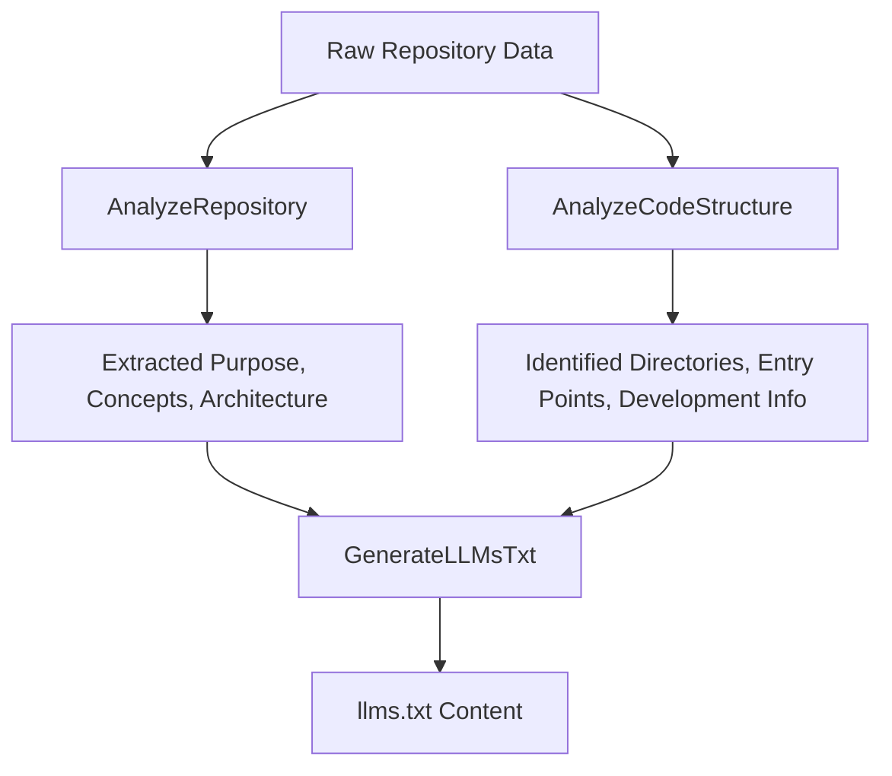
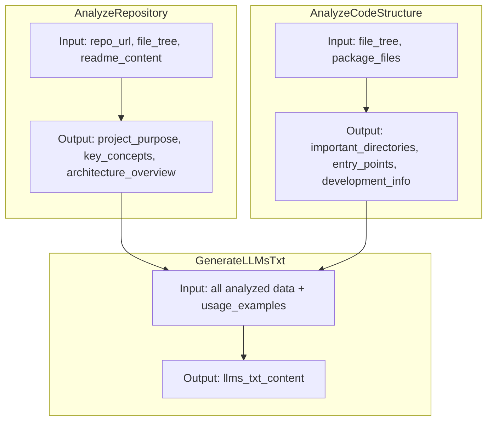

/

## Unlocking Repository Insights Through Structured Analysis

This component defines a set of classes dedicated to dissecting and understanding the structure and organization of a software repository. Its primary purpose is to analyze the repository’s layout, interpret key components such as the README and configuration files, and synthesize this information into a comprehensive textual artifact (<WalkThruCodeTag id="2ba2292f-a7b1-4c3a-8ae0-fc7ea0df8586" path="analysis/signatures.py" line_data="&quot;&quot;&quot;Generate a comprehensive llms.txt file from analyzed repository information.&quot;&quot;&quot;" line_start="24" line_end="24" >llms</WalkThruCodeTag>). This artifact serves as a detailed summary of the project’s purpose, architecture, and usage, enabling downstream tools or users—such as large language models—to grasp the repository’s essence quickly.

Strategically, these analysis classes form a critical layer in the overall system architecture by transforming raw repository data into structured knowledge. They bridge the gap between unstructured repository contents and actionable insights, facilitating automation in documentation generation, onboarding, and code comprehension tasks.

&abpn
## Architectural Blueprint of the Repository Analysis Workflow

The core architectural elements of this component include:

- **AnalyzeRepository**: Analyzes the repository structure and README to extract the project’s purpose, key concepts, and architectural overview.
- **AnalyzeCodeStructure**: Processes the repository’s file tree and package configuration files to identify important directories, entry points, and development workflows.
- **GenerateLLMsTxt**: Consolidates all analyzed information to produce the final <WalkThruCodeTag id="2ba2292f-a7b1-4c3a-8ae0-fc7ea0df8586" path="analysis/signatures.py" line_data="&quot;&quot;&quot;Generate a comprehensive llms.txt file from analyzed repository information.&quot;&quot;&quot;" line_start="24" line_end="24" >llms</WalkThruCodeTag> file, a standardized document summarizing the repository.
These classes are implemented as specialized <WalkThruCodeTag id="2ba2292f-a7b1-4c3a-8ae0-fc7ea0df8586" path="analysis/signatures.py" line_data="class AnalyzeRepository(dspy.Signature):" line_start="4" line_end="4" >Signature</WalkThruCodeTag> subclasses, each with clearly defined input and output fields to enforce a clean data flow and separation of concerns.

The interaction flow can be visualized as follows:

&abpn



- **Raw Repository Data** includes the repository URL, file tree, README content, and package files.
- **AnalyzeRepository** focuses on high-level semantic analysis from the README and repository metadata.
- **AnalyzeCodeStructure** dives into the physical layout and configuration files to map code organization.
- **GenerateLLMsTxt** merges these insights into a coherent, formatted textual summary.
This modular design allows each analysis phase to evolve independently, improving maintainability and enabling targeted enhancements.

&abpn
## Inside the Analysis Classes: Design Rationales and Implementation Details

&abpn
### AnalyzeRepository: Capturing Project Essence

This class accepts the GitHub repository URL, the file tree, and the README content as inputs. Its outputs are the project’s main purpose, a list of key concepts, and a high-level architecture overview.

- **Why this design?** The README and repository metadata are often the richest sources of human-readable context. By isolating this analysis, the system can focus on semantic understanding without being distracted by low-level file details.
- **Benefits:** This separation ensures that the conceptual understanding of the project is cleanly extracted, facilitating accurate documentation and knowledge extraction.
&abpn
### AnalyzeCodeStructure: Mapping the Codebase Layout

Inputs to this class are the repository’s file tree and key package files (such as <WalkThruCodeTag id="2ba2292f-a7b1-4c3a-8ae0-fc7ea0df8586" path="analysis/repository_info.py" line_data="for file_path in [&quot;pyproject.toml&quot;, &quot;setup.py&quot;, &quot;requirements.txt&quot;, &quot;package.json&quot;]:" line_start="49" line_end="49" >pyproject</WalkThruCodeTag>, `setup.py`, <WalkThruCodeTag id="2ba2292f-a7b1-4c3a-8ae0-fc7ea0df8586" path="analysis/repository_info.py" line_data="for file_path in [&quot;pyproject.toml&quot;, &quot;setup.py&quot;, &quot;requirements.txt&quot;, &quot;package.json&quot;]:" line_start="49" line_end="49" >requirements</WalkThruCodeTag>, and <WalkThruCodeTag id="2ba2292f-a7b1-4c3a-8ae0-fc7ea0df8586" path="analysis/repository_info.py" line_data="for file_path in [&quot;pyproject.toml&quot;, &quot;setup.py&quot;, &quot;requirements.txt&quot;, &quot;package.json&quot;]:" line_start="49" line_end="49" >package</WalkThruCodeTag>). It outputs lists of important directories, entry points, and detailed development workflow information.

- **Design reasoning:** Code organization and configuration files reveal how a project is structured and built. By parsing these, the system identifies critical components like source directories, test suites, and main executable scripts.
- **Advantages:** This focused analysis allows for precise identification of the codebase’s architecture, which is essential for understanding how to navigate and work with the project.
&abpn
### GenerateLLMsTxt: Synthesizing a Comprehensive Summary

This class takes all previously extracted information—project purpose, key concepts, architecture overview, important directories, entry points, development info, and usage examples—and generates the final <WalkThruCodeTag id="2ba2292f-a7b1-4c3a-8ae0-fc7ea0df8586" path="analysis/signatures.py" line_data="&quot;&quot;&quot;Generate a comprehensive llms.txt file from analyzed repository information.&quot;&quot;&quot;" line_start="24" line_end="24" >llms</WalkThruCodeTag> content.

- **Purpose:** To produce a standardized, human- and machine-readable summary that encapsulates all critical repository insights.
- **Why consolidate here?** Centralizing the output generation ensures consistency in formatting and completeness, making the <WalkThruCodeTag id="2ba2292f-a7b1-4c3a-8ae0-fc7ea0df8586" path="analysis/signatures.py" line_data="&quot;&quot;&quot;Generate a comprehensive llms.txt file from analyzed repository information.&quot;&quot;&quot;" line_start="24" line_end="24" >llms</WalkThruCodeTag> a reliable artifact for downstream consumption.
&abpn
### Implementation Highlights

- Each class inherits from <WalkThruCodeTag id="2ba2292f-a7b1-4c3a-8ae0-fc7ea0df8586" path="analysis/signatures.py" line_data="class AnalyzeRepository(dspy.Signature):" line_start="4" line_end="4" >Signature</WalkThruCodeTag>, leveraging its declarative input/output field definitions. This enforces strict typing and clear data contracts, which improves robustness and integration.
- Input fields are annotated with descriptive metadata, enhancing self-documentation and enabling automated tooling to generate user prompts or validation.
- Output fields are designed to capture both textual summaries and structured lists, reflecting the dual nature of repository analysis (narrative and structural).
- The modular class design supports incremental analysis: initial repository scanning, detailed code structure parsing, and final report generation.
&abpn



This layered approach aligns with software architecture best practices, promoting separation of concerns, testability, and ease of extension.

&abpn

<WalkThruSnippet id="2ba2292f-a7b1-4c3a-8ae0-fc7ea0df8586" path="analysis/signatures.py"   new_line_start="4" new_line_end="33"   language="javascript" >
```
class AnalyzeRepository(dspy.Signature):
    """Analyze a repository structure and identify key components."""
    repo_url: str = dspy.InputField(desc="GitHub repository URL")
    file_tree: str = dspy.InputField(desc="Repository file structure")
    readme_content: str = dspy.InputField(desc="README.md content")

    project_purpose: str = dspy.OutputField(desc="Main purpose and goals of the project")
    key_concepts: list[str] = dspy.OutputField(desc="List of important concepts and terminology")
    architecture_overview: str = dspy.OutputField(desc="High-level architecture description")

class AnalyzeCodeStructure(dspy.Signature):
    """Analyze code structure to identify important directories and files."""
    file_tree: str = dspy.InputField(desc="Repository file structure")
    package_files: str = dspy.InputField(desc="Key package and configuration files")

    important_directories: list[str] = dspy.OutputField(desc="Key directories and their purposes")
    entry_points: list[str] = dspy.OutputField(desc="Main entry points and important files")
    development_info: str = dspy.OutputField(desc="Development setup and workflow information")

class GenerateLLMsTxt(dspy.Signature):
    """Generate a comprehensive llms.txt file from analyzed repository information."""
    project_purpose: str = dspy.InputField()
    key_concepts: list[str] = dspy.InputField()
    architecture_overview: str = dspy.InputField()
    important_directories: list[str] = dspy.InputField()
    entry_points: list[str] = dspy.InputField()
    development_info: str = dspy.InputField()
    usage_examples: str = dspy.InputField(desc="Common usage patterns and examples")

    llms_txt_content: str = dspy.OutputField(desc="Complete llms.txt file content following the standard format")
```
</WalkThruSnippet>

&abpn
## Related Sub-Chapters

For a broader understanding of how these analysis classes fit into the overall system, see the *Repository Analysis Orchestration* chapter, which details how these components are coordinated to perform end-to-end repository inspection and documentation generation.

&abpn
## Sources

- <WalkThruRef id="2ba2292f-a7b1-4c3a-8ae0-fc7ea0df8586">[analysis/signatures.py](analysis/signatures.py)</WalkThruRef>
&abpn