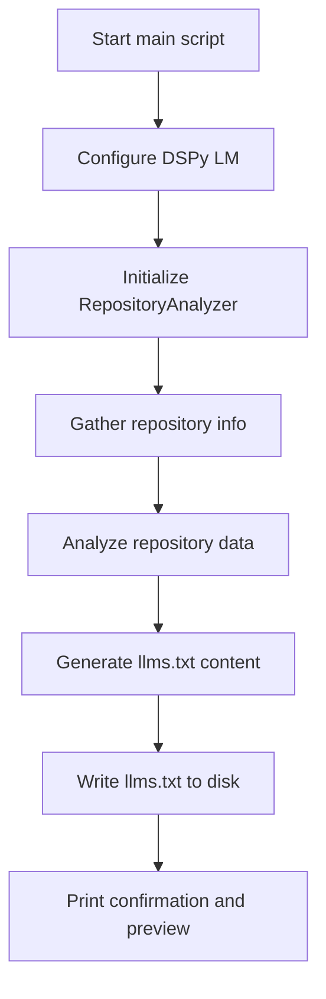
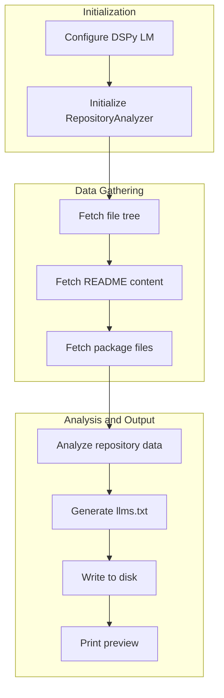

&abpn
## Orchestrating DSPy Initialization and Repository Analysis

The entry point of the DSPy project is encapsulated in the main script, which serves as the initial trigger for the entire workflow. This component is crucial because it establishes the environment, configures the language model, and coordinates the gathering and processing of repository data to ultimately generate the <WalkThruCodeTag id="91a3a52a-82f5-4f05-9f8c-386bd2ee8c4d" path="scripts/main.py" line_data="# Generate llms.txt" line_start="19" line_end="19" outdated="false" obsolete="false">llms</WalkThruCodeTag> output file. By centralizing these responsibilities, the main script acts as the strategic hub that ties together the underlying modules and analysis logic, ensuring a seamless and repeatable execution path.

This design reflects a clear separation of concerns: the main script does not embed complex logic itself but rather initializes key components and invokes specialized functions and classes. This approach enhances maintainability, testability, and extensibility, allowing the system to evolve by swapping out or upgrading individual parts without disrupting the overall flow.

&abpn
## Architectural Flow of Repository Analysis and Output Generation

The architecture of the entry point involves several key elements:

- **DSPy Language Model Configuration**: The main script initializes the DSPy language model (LM) with a specified model variant (<WalkThruCodeTag id="91a3a52a-82f5-4f05-9f8c-386bd2ee8c4d" path="scripts/main.py" oldlinedata="lm = dspy.LM(model=&quot;gpt-4o-mini&quot;)" newlinedata="lm = dspy.LM(model=&quot;gpt-4o-mini&quot;)" oldlinestart="7" oldlineend="7" newlinestart="8" newlineend="8" outdated="true" obsolete="false" oldcodetag="gpt-4o-mini"></WalkThruCodeTag>) and configures the DSPy environment to use this LM instance for downstream processing.
- **Repository Analyzer**: An instance of <WalkThruCodeTag id="91a3a52a-82f5-4f05-9f8c-386bd2ee8c4d" path="scripts/main.py" line_data="from analysis.repository_analyzer import RepositoryAnalyzer" line_start="3" line_end="3" outdated="false" obsolete="false">RepositoryAnalyzer</WalkThruCodeTag> is created, responsible for analyzing the repository data and generating structured insights.
- **Repository Information Gathering**: The <WalkThruCodeTag id="91a3a52a-82f5-4f05-9f8c-386bd2ee8c4d" path="scripts/main.py" line_data="from analysis.repository_info import gather_repository_info" line_start="4" line_end="4" outdated="false" obsolete="false">gather_repository_info</WalkThruCodeTag> function fetches critical repository data, including the file tree, README content, and key package files, by querying the GitHub API.
- **Result Generation and Persistence**: The analyzer processes the gathered data and produces the <WalkThruCodeTag id="91a3a52a-82f5-4f05-9f8c-386bd2ee8c4d" path="scripts/main.py" oldlinedata="# Generate llms.txt" newlinedata="# Generate llms.txt" oldlinestart="18" oldlineend="18" newlinestart="19" newlineend="19" outdated="true" obsolete="false" oldcodetag="llms.txt">llms</WalkThruCodeTag> content, which is then saved to disk and previewed in the console.
These elements interact in a linear, orchestrated pipeline, where each step builds on the output of the previous one, resulting in a cohesive and automated workflow.

&abpn



This architecture emphasizes modularity and clarity. By isolating repository data fetching from analysis and output generation, the system can easily adapt to changes in data sources or analysis strategies.

&abpn
## Inside the Main Script: Design Choices and Execution Logic

The main.py script embodies a straightforward yet purposeful design, focusing on clarity and robustness:

- **Explicit LM Configuration**: The script explicitly instantiates a DSPy language model with the <WalkThruCodeTag id="91a3a52a-82f5-4f05-9f8c-386bd2ee8c4d" path="scripts/main.py" line_data="lm = dspy.LM(model=&quot;gpt-4o-mini&quot;)" line_start="8" line_end="8" outdated="false" obsolete="false"></WalkThruCodeTag> model name and configures the DSPy environment accordingly. This explicit configuration allows users to easily swap out or upgrade the LM without modifying internal logic, supporting flexibility and experimentation.
- **Environment Variable Dependency**: The script expects the <WalkThruCodeTag id="91a3a52a-82f5-4f05-9f8c-386bd2ee8c4d" path="scripts/main.py" line_data="# Make sure to set your OPENAI_API_KEY environment variable" line_start="10" line_end="10" outdated="false" obsolete="false">OPENAI_API_KEY</WalkThruCodeTag> environment variable to be set, enforcing a secure and standard method of credential management. This approach avoids hardcoding sensitive information and aligns with best practices for API key handling.
- **Repository Analyzer Initialization**: Creating an instance of <WalkThruCodeTag id="91a3a52a-82f5-4f05-9f8c-386bd2ee8c4d" path="scripts/main.py" line_data="from analysis.repository_analyzer import RepositoryAnalyzer" line_start="3" line_end="3" outdated="false" obsolete="false">RepositoryAnalyzer</WalkThruCodeTag> separates analysis logic from orchestration, adhering to the single responsibility principle. This design facilitates unit testing and potential reuse in other contexts.
- **Repository Data Acquisition**: The <WalkThruCodeTag id="91a3a52a-82f5-4f05-9f8c-386bd2ee8c4d" path="scripts/main.py" line_data="from analysis.repository_info import gather_repository_info" line_start="4" line_end="4" outdated="false" obsolete="false">gather_repository_info</WalkThruCodeTag> function encapsulates the complexity of interacting with GitHub’s API, including fetching the file tree, README, and key package files. This abstraction simplifies the main script and isolates external API dependencies.
- **Result Handling and Output**: After analysis, the script writes the generated <WalkThruCodeTag id="91a3a52a-82f5-4f05-9f8c-386bd2ee8c4d" path="scripts/main.py" oldlinedata="# Generate llms.txt" newlinedata="# Generate llms.txt" oldlinestart="18" oldlineend="18" newlinestart="19" newlineend="19" outdated="true" obsolete="false" oldcodetag="llms.txt">llms</WalkThruCodeTag> content to a file and prints a confirmation along with a preview snippet. This immediate feedback loop aids developers in verifying output correctness without manually opening files.
&abpn



This linear and modular flow reduces complexity and improves readability. Each step is logically distinct, making the script easy to maintain and extend.

&abpn
### Why This Approach?

- **Separation of Concerns**: By delegating repository data fetching and analysis to dedicated modules, the main script remains clean and focused on orchestration.
- **Configurability**: The explicit LM configuration enables easy experimentation with different language models or parameters.
- **User Feedback**: Printing a preview of the generated content immediately after creation helps users quickly validate the output, improving developer experience.
- **Security Best Practices**: Relying on environment variables for API keys reduces the risk of accidental credential exposure.
These design decisions collectively contribute to a robust, maintainable, and user-friendly entry point for the DSPy project.

&abpn

<WalkThruSnippet id="91a3a52a-82f5-4f05-9f8c-386bd2ee8c4d" outdated="true" obsolete="false" path="scripts/main.py" old_line_start="" old_line_end="" new_line_start="1" new_line_end="35" language="javascript">
```
import os
import dspy
from analysis.repository_analyzer import RepositoryAnalyzer
from analysis.repository_info import gather_repository_info

def main():
    &abpn
    # Configure DSPy (use your preferred LM)
    lm = dspy.LM(model="gpt-4o-mini")
    dspy.configure(lm=lm)
    &abpn
    # Make sure to set your OPENAI_API_KEY environment variable

    &abpn
    # Initialize our analyzer
    analyzer = RepositoryAnalyzer()

    &abpn
    # Gather DSPy repository information
    repo_url = "https://github.com/stanfordnlp/dspy"
    file_tree, readme_content, package_files = gather_repository_info(repo_url)

    &abpn
    # Generate llms.txt
    result = analyzer(
        repo_url=repo_url,
        file_tree=file_tree,
        readme_content=readme_content,
        package_files=package_files
    )

    &abpn
    # Save the generated llms.txt
    with open("llms.txt", "w") as f:
        f.write(result.llms_txt_content)

    print("Generated llms.txt file!")
    print("
Preview:")
    print(result.llms_txt_content[:500] + "...")

if __name__ == "__main__":
```
</WalkThruSnippet>

&abpn
## Related Sub-Chapters

For a deeper understanding of how the repository data is structured and processed, see the *Project Structure and Modules* chapter. Additionally, to learn about ensuring the correctness and reliability of this initialization workflow, consult the *Testing Framework Setup* chapter.

&abpn
## Sources

- <WalkThruRef id="91a3a52a-82f5-4f05-9f8c-386bd2ee8c4d" obsolete="false">[scripts/main.py](scripts/main.py)</WalkThruRef>  
- <WalkThruRef id="91a3a52a-82f5-4f05-9f8c-386bd2ee8c4d" obsolete="false">[analysis/repository_info.py](analysis/repository_info.py)</WalkThruRef>  
- <WalkThruRef id="91a3a52a-82f5-4f05-9f8c-386bd2ee8c4d" obsolete="false">[analysis/signatures.py](analysis/signatures.py)</WalkThruRef>
&abpn