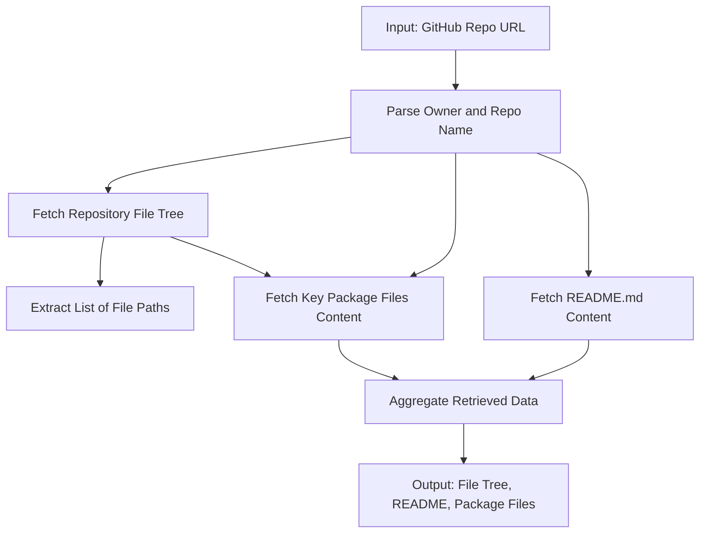
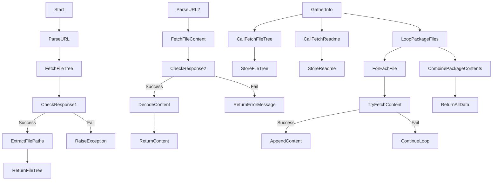

&abpn
## Unlocking Repository Insights Through GitHub API Integration

This component provides essential functions to interact directly with the GitHub API, enabling the retrieval of a repository’s file structure and the contents of specific files. Serving as the gateway to repository data, these functions form a strategic foundation for any analysis or tooling that depends on understanding a project’s layout and key files without manual cloning or inspection.

By programmatically fetching the repository’s file tree and targeted file contents, this module empowers downstream processes to operate on up-to-date source information. This approach streamlines workflows such as automated documentation generation, code analysis, or dependency inspection, which require precise and current repository snapshots.

&abpn
## Architecture of GitHub Data Access and Retrieval

&abpn
### Key Architectural Elements

- **Repository URL Parser**: Extracts the repository owner and name from a standard GitHub URL to construct API endpoints.
- **GitHub API Client**: Utilizes HTTP GET requests with authentication headers to securely query GitHub’s REST API.
- **File Tree Fetcher**: Requests the recursive file tree of the repository’s default branch to obtain a comprehensive list of files.
- **File Content Fetcher**: Retrieves the content of individual files, decoding them from base64 as returned by the API.
- **Repository Information Aggregator**: Coordinates calls to fetch the file tree, README, and key package files, consolidating this data for further use.

These components interact to provide a seamless and authenticated data retrieval pipeline. The process begins by parsing the repository URL to determine the API endpoints. Then, the file tree is fetched to understand the repository’s structure. Specific files, including README and common package management files, are fetched individually to extract their contents. This modular design isolates concerns, enabling easy extension or modification of data retrieval strategies.

&abpn

&abpn
## Inside the `repository_info.py`: Design Choices and Implementation Details

The `repository_info.py` file encapsulates all logic for interacting with GitHub’s API to retrieve repository metadata and file contents. The design centers on simplicity, reusability, and robustness:

- **Authentication via Environment Variable**: The GitHub access token is set in an environment variable (<WalkThruCodeTag id="b76bd4e0-2069-4204-b837-170712dd88ab" path="analysis/repository_info.py" line_data="os.environ[&quot;GITHUB_ACCESS_TOKEN&quot;] = &quot;&lt;your_access_token&gt;&quot;" line_start="4" line_end="4" outdated="false" obsolete="false">GITHUB_ACCESS_TOKEN</WalkThruCodeTag>) to securely authenticate API requests. This approach avoids hardcoding sensitive tokens and allows easy configuration in different environments.

- **URL Parsing for API Endpoint Construction**: Each function begins by parsing the provided GitHub repository URL to extract the <WalkThruCodeTag id="b76bd4e0-2069-4204-b837-170712dd88ab" path="analysis/repository_info.py" line_data="# Extract owner/repo from URL" line_start="8" line_end="8" outdated="false" obsolete="false">owner</WalkThruCodeTag> and <WalkThruCodeTag id="b76bd4e0-2069-4204-b837-170712dd88ab" path="analysis/repository_info.py" line_data="def get_github_file_tree(repo_url):" line_start="6" line_end="6" outdated="false" obsolete="false">repo</WalkThruCodeTag> components. This parsing is straightforward and reliable, enabling flexible input while ensuring correct API endpoint formation.

- **Fetching the Repository File Tree** (<WalkThruCodeTag id="b76bd4e0-2069-4204-b837-170712dd88ab" path="analysis/repository_info.py" line_data="def get_github_file_tree(repo_url):" line_start="6" line_end="6" outdated="false" obsolete="false">get_github_file_tree</WalkThruCodeTag>):
  - Uses the GitHub Git Trees API with the <WalkThruCodeTag id="b76bd4e0-2069-4204-b837-170712dd88ab" path="analysis/repository_info.py" line_data="api_url = f&quot;https://api.github.com/repos/{owner}/{repo}/git/trees/main?recursive=1&quot;" line_start="12" line_end="12" outdated="false" obsolete="false">recursive=1</WalkThruCodeTag> parameter to obtain a complete list of files in the repository’s default branch (<WalkThruCodeTag id="b76bd4e0-2069-4204-b837-170712dd88ab" path="analysis/repository_info.py" line_data="api_url = f&quot;https://api.github.com/repos/{owner}/{repo}/git/trees/main?recursive=1&quot;" line_start="12" line_end="12" outdated="false" obsolete="false">main</WalkThruCodeTag>).
  - Filters the response to include only blobs (files), ignoring directories or submodules.
  - Returns a sorted, newline-separated string of file paths, which simplifies downstream processing and display.
  - Raises an explicit exception if the API call fails, ensuring calling code can handle errors appropriately.
  
- **Retrieving Specific File Content** (<WalkThruCodeTag id="b76bd4e0-2069-4204-b837-170712dd88ab" path="analysis/repository_info.py" line_data="def get_github_file_content(repo_url, file_path):" line_start="24" line_end="24" outdated="false" obsolete="false">get_github_file_content</WalkThruCodeTag>):
  - Queries the GitHub Contents API for a given file path.
  - Decodes the base64-encoded content returned by GitHub to UTF-8 text.
  - Returns a fallback message if the file cannot be fetched, allowing the caller to detect missing files gracefully.
  
- **Aggregating Repository Information** (<WalkThruCodeTag id="b76bd4e0-2069-4204-b837-170712dd88ab" path="analysis/repository_info.py" line_data="def gather_repository_info(repo_url):" line_start="41" line_end="41" outdated="false" obsolete="false">gather_repository_info</WalkThruCodeTag>):
  - Combines the above functions to obtain the full file tree and README content.
  - Attempts to fetch key package-related files commonly found in repositories (<WalkThruCodeTag id="b76bd4e0-2069-4204-b837-170712dd88ab" path="analysis/repository_info.py" line_data="for file_path in [&quot;pyproject.toml&quot;, &quot;setup.py&quot;, &quot;requirements.txt&quot;, &quot;package.json&quot;]:" line_start="48" line_end="48" outdated="false" obsolete="false">pyproject.toml</WalkThruCodeTag>, `setup.py`, <WalkThruCodeTag id="b76bd4e0-2069-4204-b837-170712dd88ab" path="analysis/repository_info.py" line_data="for file_path in [&quot;pyproject.toml&quot;, &quot;setup.py&quot;, &quot;requirements.txt&quot;, &quot;package.json&quot;]:" line_start="48" line_end="48" outdated="false" obsolete="false">requirements.txt</WalkThruCodeTag>, <WalkThruCodeTag id="b76bd4e0-2069-4204-b837-170712dd88ab" path="analysis/repository_info.py" line_data="for file_path in [&quot;pyproject.toml&quot;, &quot;setup.py&quot;, &quot;requirements.txt&quot;, &quot;package.json&quot;]:" line_start="48" line_end="48" outdated="false" obsolete="false">package.json</WalkThruCodeTag>).
  - Collects the contents of these files if present, concatenating them with clear headers for each file.
  - Uses a `try-except` block around each file fetch to ensure that failures in retrieving one file do not halt the entire aggregation process.
  
This modular and defensive design enhances reliability and maintainability. By separating concerns into focused functions, the code is easier to test and extend. For example, additional file types or branches could be supported with minimal changes.

&abpn

&abpn
### Important Implementation Notes

- **Hardcoded Branch Reference**: The file tree is fetched from the <WalkThruCodeTag id="b76bd4e0-2069-4204-b837-170712dd88ab" path="analysis/repository_info.py" line_data="api_url = f&quot;https://api.github.com/repos/{owner}/{repo}/git/trees/main?recursive=1&quot;" line_start="12" line_end="12" outdated="false" obsolete="false">main</WalkThruCodeTag> branch explicitly. This assumes repositories use <WalkThruCodeTag id="b76bd4e0-2069-4204-b837-170712dd88ab" path="analysis/repository_info.py" line_data="api_url = f&quot;https://api.github.com/repos/{owner}/{repo}/git/trees/main?recursive=1&quot;" line_start="12" line_end="12" outdated="false" obsolete="false">main</WalkThruCodeTag> as the default branch, which is common but not universal. This choice simplifies the implementation but may require enhancement to dynamically detect the default branch for broader compatibility.

- **Error Handling Strategy**: The file tree fetch raises an exception on failure, signaling critical failure to the caller. In contrast, individual file content fetches return a string indicating failure, allowing the aggregator to continue processing other files. This nuanced approach balances strictness and resilience.

- **Base64 Decoding**: GitHub’s API returns file content encoded in base64 to safely transport binary or text data. Decoding this content ensures the returned strings are usable directly for text processing or display.

- **Package File Selection**: The aggregator targets common package descriptor files across different ecosystems (<WalkThruCodeTag id="b76bd4e0-2069-4204-b837-170712dd88ab" path="analysis/repository_info.py" line_data="for file_path in [&quot;pyproject.toml&quot;, &quot;setup.py&quot;, &quot;requirements.txt&quot;, &quot;package.json&quot;]:" line_start="48" line_end="48" outdated="false" obsolete="false">pyproject.toml</WalkThruCodeTag> for Python, <WalkThruCodeTag id="b76bd4e0-2069-4204-b837-170712dd88ab" path="analysis/repository_info.py" line_data="for file_path in [&quot;pyproject.toml&quot;, &quot;setup.py&quot;, &quot;requirements.txt&quot;, &quot;package.json&quot;]:" line_start="48" line_end="48" outdated="false" obsolete="false">package.json</WalkThruCodeTag> for Node.js, etc.), enabling multi-language support and richer project insights.

By focusing on these design principles, the module achieves a robust and extensible foundation for repository data retrieval, crucial for any system that automates understanding or processing of GitHub-hosted projects (see analysis/repository_info.py:1-59).

&abpn
## Sources

- <WalkThruRef id="b76bd4e0-2069-4204-b837-170712dd88ab" obsolete="false">[analysis/repository_info.py](analysis/repository_info.py)</WalkThruRef>