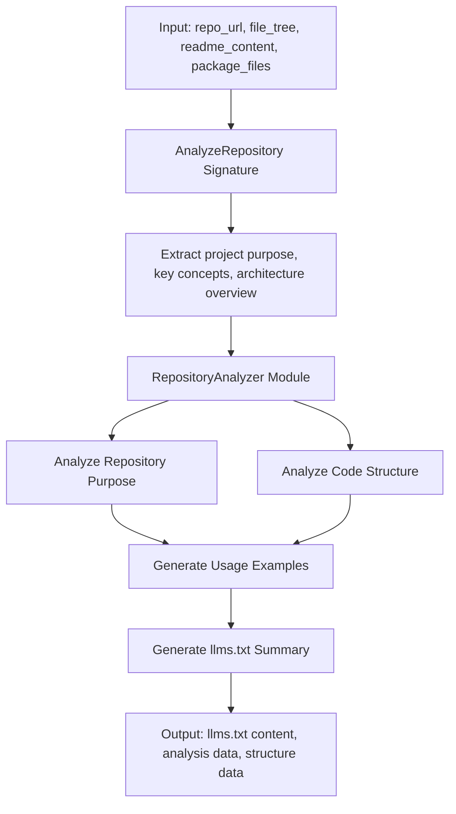
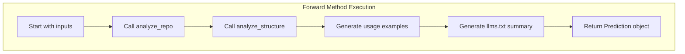

&abpn
## Unveiling the Repository Analysis Engine: Purpose and Strategic Role

This project is architected to perform an in-depth analysis of GitHub repositories by extracting critical repository information, dissecting the code structure, and synthesizing a detailed <WalkThruCodeTag id="1e159d75-6f80-4df4-9dc2-e6e15c646a75" path="analysis/repository_analyzer.py" line_data="# Generate final llms.txt" line_start="28" line_end="28" outdated="false" obsolete="false">llms.txt</WalkThruCodeTag> file that encapsulates the repository’s purpose and its key components. At its core, this system serves as an intelligent assistant for developers and analysts, enabling rapid comprehension of unfamiliar codebases without manual inspection.

The strategic importance of this component lies in its ability to automate the traditionally time-consuming task of understanding diverse repositories. By programmatically gathering repository metadata, analyzing the file and code layout, and generating a human-readable summary, it accelerates onboarding, documentation, and decision-making processes. This not only improves developer productivity but also enhances knowledge sharing and code maintenance practices across teams.

The project’s high-level architecture is modular, comprising distinct script entry points, an analysis module encapsulating the core logic, and a testing module ensuring reliability. The main entry point initializes the DSPy language model environment, orchestrates the repository analysis workflow, and outputs the final results. This modular design promotes separation of concerns, maintainability, and extensibility, enabling future enhancements such as support for additional repository types or more sophisticated analysis techniques.

&abpn
## Architectural Blueprint: Modular Chain-of-Thought Design for Repository Analysis

&abpn
### Key Architectural Elements

- **AnalyzeRepository Signature**: Defines the input-output contract for analyzing repository metadata and structure.
- **RepositoryAnalyzer Module**: Orchestrates multiple analysis steps using chained reasoning workflows.
- **ChainOfThought Constructs**: Encapsulate distinct analysis stages, including repository purpose extraction, code structure analysis, usage example generation, and final summary compilation.
- **DSPy Language Model Initialization**: Provides the AI-powered reasoning backbone for interpreting repository data.
- **Entry Point Scripts**: Initialize the environment and trigger the analysis pipeline.
- **Testing Module**: Validates the correctness and robustness of analysis components.

&abpn
### Interaction and Workflow

The system operates as a pipeline where each stage builds upon the previous analysis results. Initially, repository metadata such as the URL, file tree, and README content are fed into the <WalkThruCodeTag id="1e159d75-6f80-4df4-9dc2-e6e15c646a75" path="analysis/signatures.py" line_data="class AnalyzeRepository(dspy.Signature):" line_start="4" line_end="4" outdated="false" obsolete="false">AnalyzeRepository</WalkThruCodeTag> signature. This component extracts the project’s purpose, key concepts, and an architectural overview.

Next, the <WalkThruCodeTag id="1e159d75-6f80-4df4-9dc2-e6e15c646a75" path="analysis/repository_analyzer.py" line_data="class RepositoryAnalyzer(dspy.Module):" line_start="1" line_end="1" outdated="false" obsolete="false">RepositoryAnalyzer</WalkThruCodeTag> module invokes a chain of reasoning steps:

1. **Repository Purpose Analysis**: Interprets the repository’s goals and terminology.
2. **Code Structure Analysis**: Examines the file hierarchy and identifies important directories and entry points.
3. **Usage Example Generation**: Creates practical code usage snippets based on the analyzed information.
4. **Summary File Generation**: Compiles all insights into a comprehensive <WalkThruCodeTag id="1e159d75-6f80-4df4-9dc2-e6e15c646a75" path="analysis/repository_analyzer.py" line_data="# Generate final llms.txt" line_start="28" line_end="28" outdated="false" obsolete="false">llms.txt</WalkThruCodeTag> document.

This flow ensures each analysis phase is modular and reusable, facilitating clear separation between understanding repository intent and dissecting its structure.

&abpn

This architectural approach leverages the DSPy framework’s <WalkThruCodeTag id="1e159d75-6f80-4df4-9dc2-e6e15c646a75" path="analysis/repository_analyzer.py" line_data="self.analyze_repo = dspy.ChainOfThought(AnalyzeRepository)" line_start="4" line_end="4" outdated="false" obsolete="false">ChainOfThought</WalkThruCodeTag> pattern to modularize complex reasoning tasks, enhancing clarity and maintainability.

&abpn
## Inside the RepositoryAnalyzer: Design Choices and Functional Insights

The <WalkThruCodeTag id="1e159d75-6f80-4df4-9dc2-e6e15c646a75" path="analysis/repository_analyzer.py" line_data="class RepositoryAnalyzer(dspy.Module):" line_start="1" line_end="1" outdated="false" obsolete="false">RepositoryAnalyzer</WalkThruCodeTag> class embodies the core logic of the analysis pipeline. Its constructor initializes four primary chain-of-thought components:

- <WalkThruCodeTag id="1e159d75-6f80-4df4-9dc2-e6e15c646a75" path="analysis/repository_analyzer.py" line_data="repo_analysis = self.analyze_repo(" line_start="11" line_end="11" outdated="false" obsolete="false">analyze_repo</WalkThruCodeTag>: Implements the <WalkThruCodeTag id="1e159d75-6f80-4df4-9dc2-e6e15c646a75" path="analysis/signatures.py" line_data="class AnalyzeRepository(dspy.Signature):" line_start="4" line_end="4" outdated="false" obsolete="false">AnalyzeRepository</WalkThruCodeTag> signature to extract semantic information about the repository.
- <WalkThruCodeTag id="1e159d75-6f80-4df4-9dc2-e6e15c646a75" path="analysis/repository_analyzer.py" line_data="structure_analysis = self.analyze_structure(" line_start="18" line_end="18" outdated="false" obsolete="false">analyze_structure</WalkThruCodeTag>: Processes the repository’s file tree and package files to identify structural elements.
- <WalkThruCodeTag id="1e159d75-6f80-4df4-9dc2-e6e15c646a75" path="analysis/repository_analyzer.py" line_data="usage_examples = self.generate_examples(" line_start="24" line_end="24" outdated="false" obsolete="false">generate_examples</WalkThruCodeTag>: Produces illustrative usage examples from the previously gathered repository information.
- <WalkThruCodeTag id="1e159d75-6f80-4df4-9dc2-e6e15c646a75" path="analysis/repository_analyzer.py" line_data="llms_txt = self.generate_llms_txt(" line_start="29" line_end="29" outdated="false" obsolete="false">generate_llms_txt</WalkThruCodeTag>: Synthesizes a comprehensive summary file combining all prior insights.

This design leverages the DSPy <WalkThruCodeTag id="1e159d75-6f80-4df4-9dc2-e6e15c646a75" path="analysis/repository_analyzer.py" line_data="self.analyze_repo = dspy.ChainOfThought(AnalyzeRepository)" line_start="4" line_end="4" outdated="false" obsolete="false">ChainOfThought</WalkThruCodeTag> abstraction to encapsulate each analysis step as a distinct reasoning module. This separation allows each component to focus on a single responsibility, facilitating easier testing, debugging, and future enhancements.

The <WalkThruCodeTag id="1e159d75-6f80-4df4-9dc2-e6e15c646a75" path="analysis/repository_analyzer.py" line_data="def forward(self, repo_url, file_tree, readme_content, package_files):" line_start="9" line_end="9" outdated="false" obsolete="false">forward</WalkThruCodeTag> method orchestrates the execution flow:

1. **Repository Semantic Analysis**  
   It calls <WalkThruCodeTag id="1e159d75-6f80-4df4-9dc2-e6e15c646a75" path="analysis/repository_analyzer.py" line_data="repo_analysis = self.analyze_repo(" line_start="11" line_end="11" outdated="false" obsolete="false">analyze_repo</WalkThruCodeTag> with the repository URL, file tree, and README content to understand the project’s purpose and terminology.

2. **Code Structure Analysis**  
   It invokes <WalkThruCodeTag id="1e159d75-6f80-4df4-9dc2-e6e15c646a75" path="analysis/repository_analyzer.py" line_data="structure_analysis = self.analyze_structure(" line_start="18" line_end="18" outdated="false" obsolete="false">analyze_structure</WalkThruCodeTag> with the file tree and package files to identify important directories, entry points, and development information.

3. **Usage Example Generation**  
   Using the combined purpose and concept information, it generates practical usage examples to aid comprehension.

4. **Summary Compilation**  
   Finally, it calls <WalkThruCodeTag id="1e159d75-6f80-4df4-9dc2-e6e15c646a75" path="analysis/repository_analyzer.py" line_data="llms_txt = self.generate_llms_txt(" line_start="29" line_end="29" outdated="false" obsolete="false">generate_llms_txt</WalkThruCodeTag> to produce the <WalkThruCodeTag id="1e159d75-6f80-4df4-9dc2-e6e15c646a75" path="analysis/repository_analyzer.py" line_data="# Generate final llms.txt" line_start="28" line_end="28" outdated="false" obsolete="false">llms.txt</WalkThruCodeTag> content, incorporating all gathered data including architecture overview and usage examples.

The method returns a structured prediction object containing the summary content and detailed analysis results, supporting both human consumption and potential downstream automation.

&abpn

This layered approach ensures that each stage’s output feeds logically into the next, maintaining a clear data transformation pipeline. The use of descriptive input and output fields in <WalkThruCodeTag id="1e159d75-6f80-4df4-9dc2-e6e15c646a75" path="analysis/signatures.py" line_data="class AnalyzeRepository(dspy.Signature):" line_start="4" line_end="4" outdated="false" obsolete="false">AnalyzeRepository</WalkThruCodeTag> enhances type safety and documentation, clarifying what data is expected and produced at each step.

By structuring the analysis as chained reasoning steps, the system gains flexibility to insert additional analysis phases or modify existing ones without disrupting the overall flow. This makes the architecture robust against evolving requirements and diverse repository structures.

<small>(see analysis/repository_analyzer.py:1-43 and analysis/signatures.py:4-12)</small>

&abpn
## Sources

- <WalkThruRef id="1e159d75-6f80-4df4-9dc2-e6e15c646a75" obsolete="false">[analysis/repository_analyzer.py](analysis/repository_analyzer.py)</WalkThruRef>  
- <WalkThruRef id="1e159d75-6f80-4df4-9dc2-e6e15c646a75" obsolete="false">[analysis/signatures.py](analysis/signatures.py)</WalkThruRef>