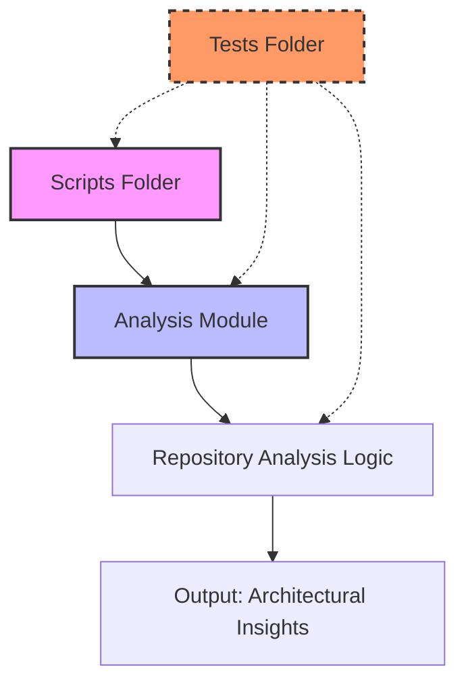
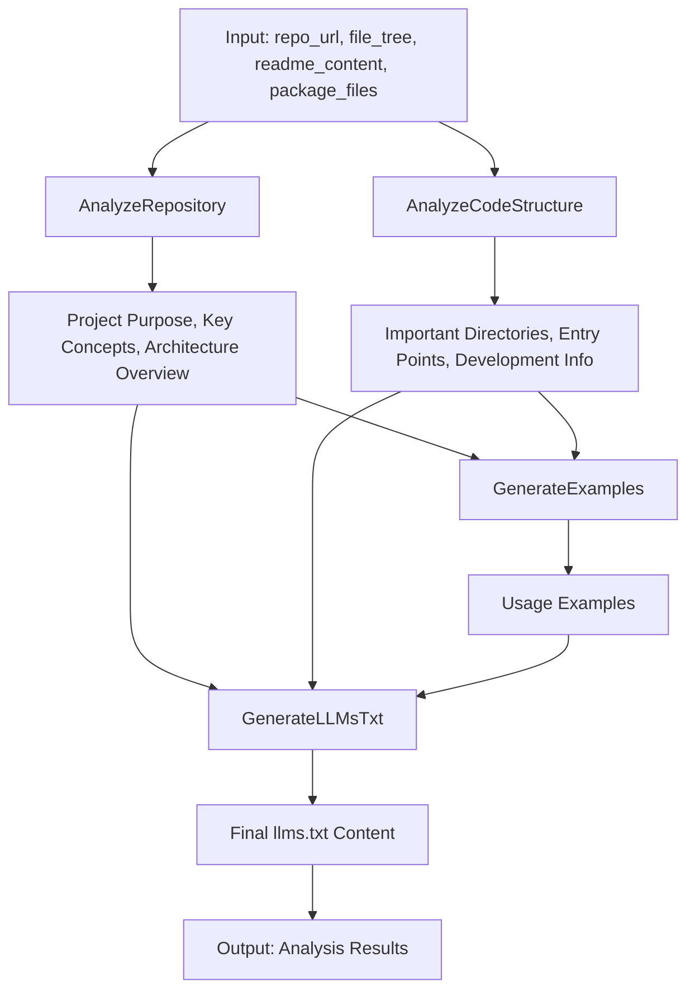

&abpn
## Organizing the Codebase for Clarity and Scalability

A well-organized project structure is fundamental to maintaining clarity, scalability, and ease of collaboration in any software system. In this project, the codebase is divided into three main folders, each serving a distinct and strategic purpose:

- **scripts**: Contains executable scripts that serve as entry points or utilities. These scripts often orchestrate higher-level workflows or trigger specific functionality.
- <WalkThruCodeTag id="066738c4-7cbe-4662-afe2-7b50d8ac651f" path="analysis/repository_analyzer.py" oldlinedata="repo_analysis = self.analyze_repo(" newlinedata="repo_analysis = self.analyze_repo(" oldlinestart="11" oldlineend="11" newlinestart="13" newlineend="13" outdated="true" obsolete="false" oldcodetag="analysis">repo_analysis</WalkThruCodeTag>: Hosts the core logic responsible for analyzing repository contents, such as parsing file structures, extracting architectural insights, and generating descriptive outputs.
- **tests**: Includes test cases that validate the correctness, reliability, and robustness of the codebase.

This modular separation ensures that each folder encapsulates a focused concern, making the codebase easier to navigate and maintain. The **scripts** folder acts as the interface layer for users or automation systems, the <WalkThruCodeTag id="066738c4-7cbe-4662-afe2-7b50d8ac651f" path="analysis/repository_analyzer.py" oldlinedata="repo_analysis = self.analyze_repo(" newlinedata="repo_analysis = self.analyze_repo(" oldlinestart="11" oldlineend="11" newlinestart="13" newlineend="13" outdated="true" obsolete="false" oldcodetag="analysis">repo_analysis</WalkThruCodeTag> folder embodies the domain logic of repository inspection, and the **tests** folder safeguards quality through automated verification.

By clearly delineating these responsibilities, developers can work concurrently on different aspects without stepping on each other’s toes, and new contributors can quickly understand where to find or place code related to specific tasks. This structure also facilitates continuous integration and deployment pipelines by isolating executable scripts from core logic and tests.

&abpn
## Architectural Foundations of the Project Layout

The key architectural elements shaping this project’s structure are:

- **Executable Scripts Layer** (`scripts`): Entry points that invoke the analysis workflows or other utilities.
- **Analysis Module** (<WalkThruCodeTag id="066738c4-7cbe-4662-afe2-7b50d8ac651f" path="analysis/repository_analyzer.py" oldlinedata="repo_analysis = self.analyze_repo(" newlinedata="repo_analysis = self.analyze_repo(" oldlinestart="11" oldlineend="11" newlinestart="13" newlineend="13" outdated="true" obsolete="false" oldcodetag="analysis">repo_analysis</WalkThruCodeTag>): Contains classes and methods implementing repository inspection, including signature definitions and analysis orchestration.
- **Testing Suite** (`tests`): Automated test cases verifying functionality and preventing regressions.

These elements interact in a streamlined flow:

1. The **scripts** trigger analysis by calling functions or classes within the <WalkThruCodeTag id="066738c4-7cbe-4662-afe2-7b50d8ac651f" path="analysis/repository_analyzer.py" oldlinedata="repo_analysis = self.analyze_repo(" newlinedata="repo_analysis = self.analyze_repo(" oldlinestart="11" oldlineend="11" newlinestart="13" newlineend="13" outdated="true" obsolete="false" oldcodetag="analysis">repo_analysis</WalkThruCodeTag> module.
2. The <WalkThruCodeTag id="066738c4-7cbe-4662-afe2-7b50d8ac651f" path="analysis/repository_analyzer.py" oldlinedata="repo_analysis = self.analyze_repo(" newlinedata="repo_analysis = self.analyze_repo(" oldlinestart="11" oldlineend="11" newlinestart="13" newlineend="13" outdated="true" obsolete="false" oldcodetag="analysis">repo_analysis</WalkThruCodeTag> module processes input data such as repository URLs, file trees, and README contents, producing structured insights.
3. The **tests** run independently or as part of CI pipelines to validate both scripts and analysis logic.

&abpn

This architectural layout promotes separation of concerns and supports extensibility. New analysis capabilities can be added within the <WalkThruCodeTag id="066738c4-7cbe-4662-afe2-7b50d8ac651f" path="analysis/repository_analyzer.py" oldlinedata="repo_analysis = self.analyze_repo(" newlinedata="repo_analysis = self.analyze_repo(" oldlinestart="11" oldlineend="11" newlinestart="13" newlineend="13" outdated="true" obsolete="false" oldcodetag="analysis">repo_analysis</WalkThruCodeTag> module without affecting scripts or tests. Likewise, scripts can be extended or replaced to accommodate different execution environments or workflows without modifying core logic.

&abpn
## Deep Dive into the Analysis Module and Its Design Choices

The <WalkThruCodeTag id="066738c4-7cbe-4662-afe2-7b50d8ac651f" path="analysis/repository_analyzer.py" oldlinedata="repo_analysis = self.analyze_repo(" newlinedata="repo_analysis = self.analyze_repo(" oldlinestart="11" oldlineend="11" newlinestart="13" newlineend="13" outdated="true" obsolete="false" oldcodetag="analysis">repo_analysis</WalkThruCodeTag> folder encapsulates the heart of the project’s logic for understanding repository structures. Central to this is the <WalkThruCodeTag id="066738c4-7cbe-4662-afe2-7b50d8ac651f" path="analysis/repository_analyzer.py" line_data="class RepositoryAnalyzer(dspy.Module):" new_line_start="3" new_line_end="3" outdated="false" obsolete="false">RepositoryAnalyzer</WalkThruCodeTag> class, which orchestrates multiple analysis steps through a chain-of-thought pattern:

- <WalkThruCodeTag id="066738c4-7cbe-4662-afe2-7b50d8ac651f" path="analysis/signatures.py" line_data="class AnalyzeRepository(dspy.Signature):" line_start="4" line_end="4" outdated="false" obsolete="false">AnalyzeRepository</WalkThruCodeTag>: Examines the repository URL, file tree, and README content to identify the project’s purpose, key concepts, and architectural overview.
- <WalkThruCodeTag id="066738c4-7cbe-4662-afe2-7b50d8ac651f" path="analysis/signatures.py" oldlinedata="class AnalyzeCodeStructure(dspy.Signature):" newlinedata="class AnalyzeRepository(dspy.Signature):" oldlinestart="14" oldlineend="14" newlinestart="4" newlineend="4" outdated="true" obsolete="false" oldcodetag="AnalyzeCodeStructure"></WalkThruCodeTag>: Inspects the file tree and package files to determine important directories, entry points, and development workflow information.
- **GenerateExamples**: Produces usage examples based on the analyzed repository information.
- **GenerateLLMsTxt**: Compiles all gathered data into a final descriptive text output.

This modular approach breaks down a complex task into manageable, reusable components. Each analysis step is encapsulated in a dedicated class or chain, allowing independent evolution and testing.

The <WalkThruCodeTag id="066738c4-7cbe-4662-afe2-7b50d8ac651f" path="analysis/repository_analyzer.py" line_data="def forward(self, repo_url, file_tree, readme_content, package_files):" new_line_start="11" new_line_end="11" outdated="false" obsolete="false">forward</WalkThruCodeTag> method of <WalkThruCodeTag id="066738c4-7cbe-4662-afe2-7b50d8ac651f" path="analysis/repository_analyzer.py" line_data="class RepositoryAnalyzer(dspy.Module):" new_line_start="3" new_line_end="3" outdated="false" obsolete="false">RepositoryAnalyzer</WalkThruCodeTag> demonstrates this design:

1. It first calls <WalkThruCodeTag id="066738c4-7cbe-4662-afe2-7b50d8ac651f" path="analysis/repository_analyzer.py" line_data="repo_analysis = self.analyze_repo(" new_line_start="13" new_line_end="13" outdated="false" obsolete="false">analyze_repo</WalkThruCodeTag> to extract high-level project insights.
2. Then it invokes <WalkThruCodeTag id="066738c4-7cbe-4662-afe2-7b50d8ac651f" path="analysis/repository_analyzer.py" line_data="structure_analysis = self.analyze_structure(" new_line_start="20" new_line_end="20" outdated="false" obsolete="false">analyze_structure</WalkThruCodeTag> to parse the codebase layout.
3. Next, it generates usage examples based on the combined analysis.
4. Finally, it aggregates all information into a single comprehensive output.

This stepwise decomposition enhances maintainability and clarity. It also aligns well with the chain-of-thought methodology, which is effective for complex reasoning tasks, such as understanding software repositories.

&abpn

The benefits of this design include:

- **Extensibility**: New analysis steps can be added as additional chains without disrupting existing logic.
- **Testability**: Each component can be individually tested to ensure correctness.
- **Reusability**: Components like <WalkThruCodeTag id="066738c4-7cbe-4662-afe2-7b50d8ac651f" path="analysis/signatures.py" line_data="class AnalyzeRepository(dspy.Signature):" line_start="4" line_end="4" outdated="false" obsolete="false">AnalyzeRepository</WalkThruCodeTag> and <WalkThruCodeTag id="066738c4-7cbe-4662-afe2-7b50d8ac651f" path="analysis/signatures.py" oldlinedata="class AnalyzeCodeStructure(dspy.Signature):" newlinedata="class AnalyzeRepository(dspy.Signature):" oldlinestart="14" oldlineend="14" newlinestart="4" newlineend="4" outdated="true" obsolete="false" oldcodetag="AnalyzeCodeStructure"></WalkThruCodeTag> can be reused in other contexts or projects.
- **Clarity**: The flow of data and transformations is explicit and easy to follow.

This architecture was chosen to handle the inherent complexity of repository analysis while maintaining a clean, modular codebase that supports future growth.

&abpn
## Related Sub-Chapters

- For information on how test cases are structured and integrated, see the *Testing Framework Setup* chapter.
- To understand how the project initializes and triggers analysis workflows, refer to the *Entry Point and Initialization* chapter.

&abpn
## Sources

- <WalkThruRef id="066738c4-7cbe-4662-afe2-7b50d8ac651f" obsolete="false">[analysis/repository_analyzer.py](analysis/repository_analyzer.py)</WalkThruRef>
- <WalkThruRef id="066738c4-7cbe-4662-afe2-7b50d8ac651f" obsolete="false">[analysis/signatures.py](analysis/signatures.py)</WalkThruRef>