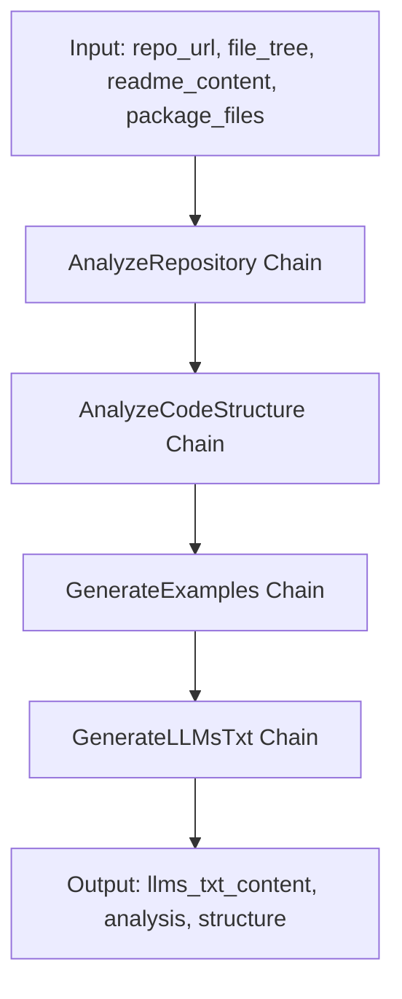
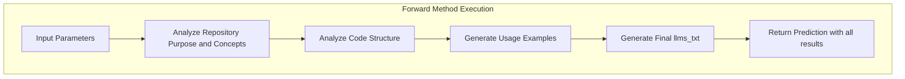

&abpn
## Orchestrating Comprehensive Repository Insights for Enhanced Understanding

The <WalkThruCodeTag id="a213e366-376d-40c8-88bf-799472046d61" path="analysis/repository_analyzer.py" line_data="class RepositoryAnalyzer(dspy.Module):" line_start="0" line_end="0" outdated="false" obsolete="false">RepositoryAnalyzer</WalkThruCodeTag> class serves as the central orchestrator for the entire repository analysis workflow. Its primary responsibility is to coordinate multiple specialized analysis chains that collectively transform raw repository data into a structured, insightful summary. This summary includes the project’s purpose, architectural overview, code structure, usage examples, and a final formatted output designed for downstream consumption.

This orchestration is crucial because analyzing a repository involves multiple distinct yet interdependent tasks: understanding the repository’s intent and key concepts, dissecting its code structure, generating practical usage examples, and synthesizing all findings into a coherent textual artifact. By encapsulating these steps within a single module, <WalkThruCodeTag id="a213e366-376d-40c8-88bf-799472046d61" path="analysis/repository_analyzer.py" line_data="class RepositoryAnalyzer(dspy.Module):" line_start="0" line_end="0" outdated="false" obsolete="false">RepositoryAnalyzer</WalkThruCodeTag> abstracts complexity and provides a unified interface for comprehensive repository analysis. This design enhances modularity, promotes separation of concerns, and facilitates maintainability and extensibility within the system architecture.

&abpn
## Coordinating Modular Analysis Chains to Build a Holistic Repository Profile

&abpn
### Key Architectural Elements

- **AnalyzeRepository Chain**: Extracts high-level information such as the project’s purpose, key concepts, and architecture overview by analyzing repository metadata and documentation.
- **AnalyzeCodeStructure Chain**: Inspects the repository’s file tree and package files to identify important directories, entry points, and development-related information.
- **GenerateExamples Chain**: Produces practical usage examples based on the repository information, aiding in understanding how to interact with the project.
- **GenerateLLMsTxt Chain**: Synthesizes all gathered information into a final formatted text artifact (<WalkThruCodeTag id="a213e366-376d-40c8-88bf-799472046d61" path="analysis/repository_analyzer.py" line_data="# Generate final llms.txt" line_start="27" line_end="27" outdated="false" obsolete="false">llms.txt</WalkThruCodeTag>), suitable for consumption by language models or documentation tools.

These elements interact in a sequential and dependent manner to fulfill the goal of comprehensive repository analysis. The process begins with extracting semantic metadata, followed by structural analysis, then example generation, and finally, synthesis into a formatted output.

&abpn


This flow ensures that each step builds upon the results of the previous one, maintaining a clear and logical progression of data transformation. The modular chains encapsulate distinct concerns, allowing for isolated development, testing, and potential replacement without impacting the entire system.

&abpn
## Inside the <WalkThruCodeTag id="a213e366-376d-40c8-88bf-799472046d61" path="analysis/repository_analyzer.py" line_data="class RepositoryAnalyzer(dspy.Module):" line_start="0" line_end="0" outdated="false" obsolete="false">RepositoryAnalyzer</WalkThruCodeTag>: A Step-by-Step Execution of Repository Understanding

The <WalkThruCodeTag id="a213e366-376d-40c8-88bf-799472046d61" path="analysis/repository_analyzer.py" line_data="class RepositoryAnalyzer(dspy.Module):" line_start="0" line_end="0" outdated="false" obsolete="false">RepositoryAnalyzer</WalkThruCodeTag> class inherits from a base module and initializes four distinct chains in its constructor. This initialization reflects a deliberate design choice to leverage chain-of-thought style processing, where each chain encapsulates a focused analysis task:

- <WalkThruCodeTag id="a213e366-376d-40c8-88bf-799472046d61" path="analysis/repository_analyzer.py" line_data="self.analyze_repo = dspy.ChainOfThought(AnalyzeRepository)" line_start="3" line_end="3" outdated="false" obsolete="false">analyze_repo</WalkThruCodeTag> uses the <WalkThruCodeTag id="a213e366-376d-40c8-88bf-799472046d61" path="analysis/signatures.py" line_data="class AnalyzeRepository(dspy.Signature):" line_start="4" line_end="4" outdated="false" obsolete="false">AnalyzeRepository</WalkThruCodeTag> signature to interpret the repository’s high-level purpose and concepts.
- <WalkThruCodeTag id="a213e366-376d-40c8-88bf-799472046d61" path="analysis/repository_analyzer.py" line_data="self.analyze_structure = dspy.ChainOfThought(AnalyzeCodeStructure)" line_start="4" line_end="4" outdated="false" obsolete="false">analyze_structure</WalkThruCodeTag> applies the <WalkThruCodeTag id="a213e366-376d-40c8-88bf-799472046d61" path="analysis/repository_analyzer.py" line_data="self.analyze_structure = dspy.ChainOfThought(AnalyzeCodeStructure)" line_start="4" line_end="4" outdated="false" obsolete="false">AnalyzeCodeStructure</WalkThruCodeTag> signature to dissect the repository’s file layout and identify key structural elements.
- <WalkThruCodeTag id="a213e366-376d-40c8-88bf-799472046d61" path="analysis/repository_analyzer.py" line_data="self.generate_examples = dspy.ChainOfThought(&quot;repo_info -&gt; usage_examples&quot;)" line_start="5" line_end="5" outdated="false" obsolete="false">generate_examples</WalkThruCodeTag> is a chain that transforms repository information into usage examples, facilitating practical comprehension.
- <WalkThruCodeTag id="a213e366-376d-40c8-88bf-799472046d61" path="analysis/repository_analyzer.py" line_data="self.generate_llms_txt = dspy.ChainOfThought(GenerateLLMsTxt)" line_start="6" line_end="6" outdated="false" obsolete="false">generate_llms_txt</WalkThruCodeTag> compiles all prior outputs into a final textual representation optimized for language model ingestion or documentation generation.

The <WalkThruCodeTag id="a213e366-376d-40c8-88bf-799472046d61" path="analysis/repository_analyzer.py" line_data="def forward(self, repo_url, file_tree, readme_content, package_files):" line_start="8" line_end="8" outdated="false" obsolete="false">forward</WalkThruCodeTag> method orchestrates the entire workflow:

1. **Repository Purpose and Concept Analysis**  
   It invokes <WalkThruCodeTag id="a213e366-376d-40c8-88bf-799472046d61" path="analysis/repository_analyzer.py" line_data="self.analyze_repo = dspy.ChainOfThought(AnalyzeRepository)" line_start="3" line_end="3" outdated="false" obsolete="false">analyze_repo</WalkThruCodeTag> with the repository URL, file tree, and README content. This step extracts the project's main goals and important terminology, which are foundational for all subsequent analyses.

2. **Code Structure Analysis**  
   Using the file tree and package files, <WalkThruCodeTag id="a213e366-376d-40c8-88bf-799472046d61" path="analysis/repository_analyzer.py" line_data="self.analyze_structure = dspy.ChainOfThought(AnalyzeCodeStructure)" line_start="4" line_end="4" outdated="false" obsolete="false">analyze_structure</WalkThruCodeTag> identifies critical directories, entry points, and development information, providing a structural context to the repository.

3. **Usage Example Generation**  
   The usage examples chain consumes a formatted string containing the project purpose and key concepts. This design leverages the semantic understanding gained earlier to generate meaningful, context-aware examples.

4. **Final Output Generation**  
   Finally, <WalkThruCodeTag id="a213e366-376d-40c8-88bf-799472046d61" path="analysis/repository_analyzer.py" line_data="self.generate_llms_txt = dspy.ChainOfThought(GenerateLLMsTxt)" line_start="6" line_end="6" outdated="false" obsolete="false">generate_llms_txt</WalkThruCodeTag> synthesizes all collected insights — including project purpose, key concepts, architecture overview, structural details, and usage examples — into a single formatted text artifact.

The method returns a prediction object encapsulating the final textual content alongside the intermediate analysis results, enabling downstream components to access granular insights if needed.

&abpn


This layered approach exemplifies several key design benefits:

- **Separation of Concerns**: Each chain focuses on a single aspect of analysis, simplifying debugging and future enhancements.
- **Reusability**: Chains can be reused independently or replaced with improved implementations without disrupting the overall workflow.
- **Traceability**: Returning intermediate results alongside the final output allows for transparent inspection of each analysis stage.
- **Scalability**: The modular design supports easy addition of new analysis steps or output formats.

The use of chain-of-thought abstractions suggests an emphasis on explainability and stepwise reasoning within the system, aligning well with modern AI-driven analysis paradigms.


&abpn
<WalkThruSnippet id="a213e366-376d-40c8-88bf-799472046d61" outdated="false" obsolete="false" path="analysis/repository_analyzer.py" old_line_start="" old_line_end="" new_line_start="1" new_line_end="43" language="javascript">
```
class RepositoryAnalyzer(dspy.Module):
    def __init__(self):
        super().__init__()
        self.analyze_repo = dspy.ChainOfThought(AnalyzeRepository)
        self.analyze_structure = dspy.ChainOfThought(AnalyzeCodeStructure)
        self.generate_examples = dspy.ChainOfThought("repo_info -> usage_examples")
        self.generate_llms_txt = dspy.ChainOfThought(GenerateLLMsTxt)

    def forward(self, repo_url, file_tree, readme_content, package_files):
        &abpn
        # Analyze repository purpose and concepts
        repo_analysis = self.analyze_repo(
            repo_url=repo_url,
            file_tree=file_tree,
            readme_content=readme_content
        )

        &abpn
        # Analyze code structure
        structure_analysis = self.analyze_structure(
            file_tree=file_tree,
            package_files=package_files
        )

        &abpn
        # Generate usage examples
        usage_examples = self.generate_examples(
            repo_info=f"Purpose: {repo_analysis.project_purpose}
Concepts: {repo_analysis.key_concepts}"
        )

        &abpn
        # Generate final llms.txt
        llms_txt = self.generate_llms_txt(
            project_purpose=repo_analysis.project_purpose,
            key_concepts=repo_analysis.key_concepts,
            architecture_overview=repo_analysis.architecture_overview,
            important_directories=structure_analysis.important_directories,
            entry_points=structure_analysis.entry_points,
            development_info=structure_analysis.development_info,
            usage_examples=usage_examples.usage_examples
        )

        return dspy.Prediction(
            llms_txt_content=llms_txt.llms_txt_content,
            analysis=repo_analysis,
            structure=structure_analysis
        )
```
</WalkThruSnippet>


&abpn
## Related Sub-Chapters

For a deeper understanding of the specific analysis logic and how repository components are interpreted, see the *Analysis Classes and Logic* chapter. It details the signatures and chains such as <WalkThruCodeTag id="a213e366-376d-40c8-88bf-799472046d61" path="analysis/signatures.py" line_data="class AnalyzeRepository(dspy.Signature):" line_start="4" line_end="4" outdated="false" obsolete="false">AnalyzeRepository</WalkThruCodeTag> and <WalkThruCodeTag id="a213e366-376d-40c8-88bf-799472046d61" path="analysis/repository_analyzer.py" line_data="self.analyze_structure = dspy.ChainOfThought(AnalyzeCodeStructure)" line_start="4" line_end="4" outdated="false" obsolete="false">AnalyzeCodeStructure</WalkThruCodeTag> that underpin the modular chains orchestrated by <WalkThruCodeTag id="a213e366-376d-40c8-88bf-799472046d61" path="analysis/repository_analyzer.py" line_data="class RepositoryAnalyzer(dspy.Module):" line_start="0" line_end="0" outdated="false" obsolete="false">RepositoryAnalyzer</WalkThruCodeTag>.

&abpn
## Sources

- <WalkThruRef id="a213e366-376d-40c8-88bf-799472046d61" obsolete="false">[analysis/repository_analyzer.py](analysis/repository_analyzer.py)</WalkThruRef>