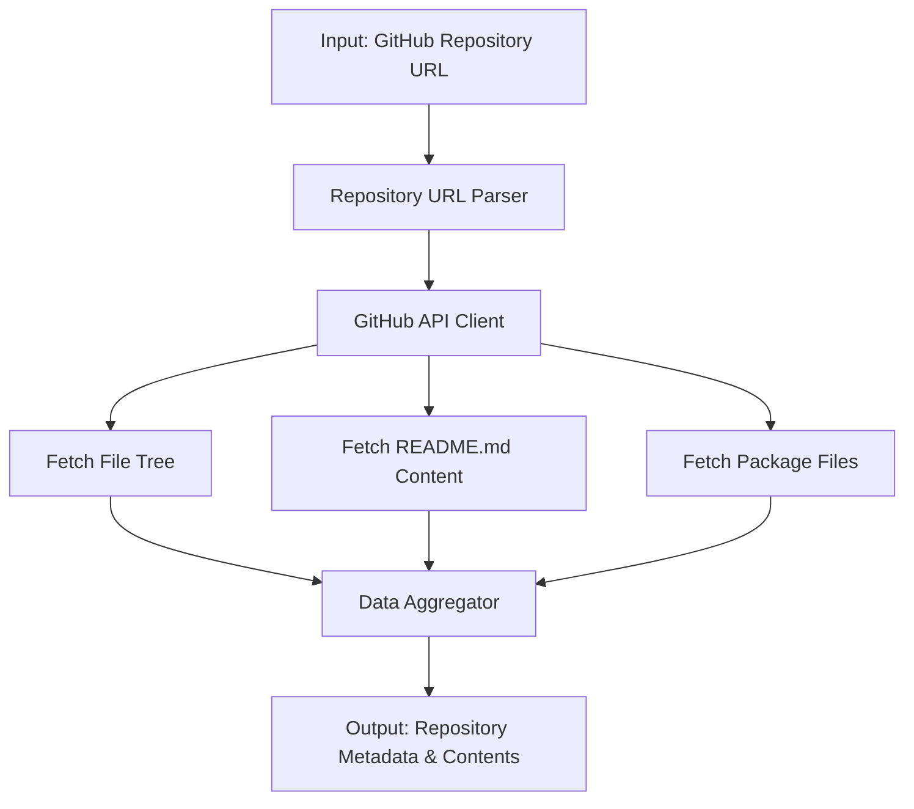
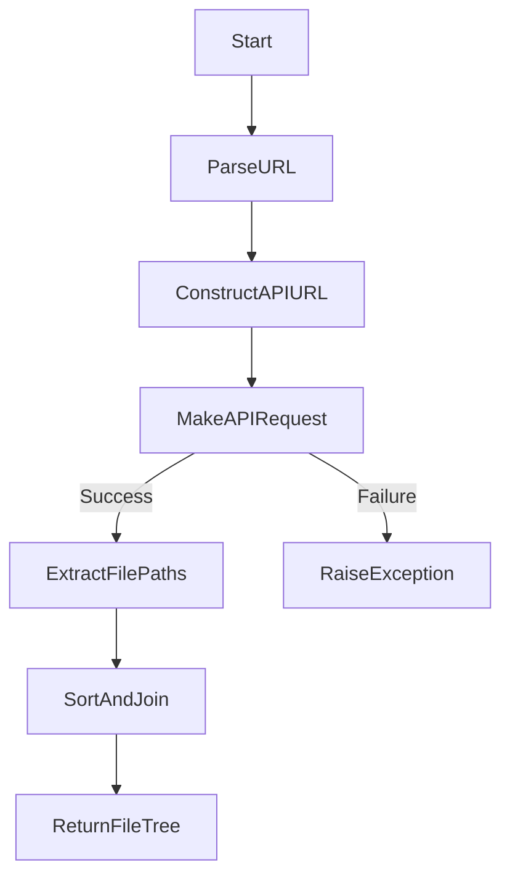
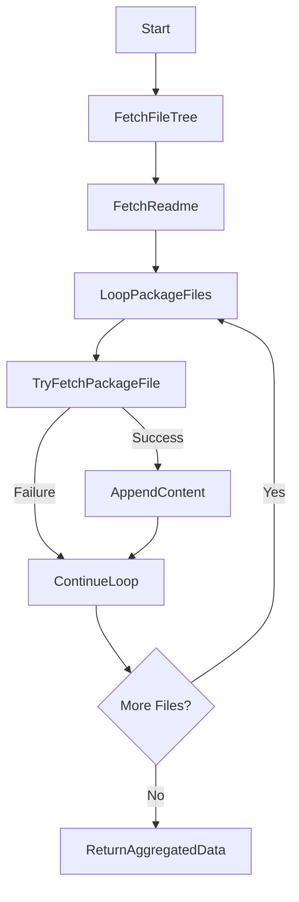

&abpn
## Unlocking Repository Insights through GitHub API Integration

In modern software development, understanding the structure and contents of a code repository is foundational to any form of automated analysis, documentation generation, or code intelligence tooling. The **Repository Information Gathering** module is designed to systematically retrieve essential metadata and file contents from GitHub repositories by leveraging GitHub's REST API.

This module plays a strategic role in the overall system by acting as the initial data acquisition layer. It abstracts the complexities of interacting with GitHub's API, providing a clean interface to obtain the repository's file tree, key configuration files, and documentation content such as the README. By centralizing repository data retrieval, downstream components can focus on analysis and interpretation without concern for data sourcing logistics.

The importance of this component lies in its ability to reliably and efficiently fetch comprehensive repository snapshots, which serve as the foundation for subsequent stages like architectural analysis, code summarization, and usage example generation. Its design ensures adaptability across diverse repositories by focusing on generic repository metadata and commonly used package descriptor files.

&abpn
## Architecture of the Repository Data Retrieval Pipeline

The architecture of this module revolves around three key elements:

- **Repository URL Parser**: Extracts the repository owner and name from a given GitHub URL.
- **GitHub API Client**: Makes authenticated HTTP requests to GitHub's API endpoints to fetch repository data.
- **Data Aggregator**: Coordinates calls to individual retrieval functions and collates the results into a structured format.

These components interact in a sequential pipeline to transform a simple repository URL into a rich dataset encompassing the entire file tree and select file contents.

&abpn

This design isolates concerns and promotes maintainability:

- The **Repository URL Parser** ensures flexibility in handling various URL formats.
- The **GitHub API Client** encapsulates authentication and request logic, enabling easy updates if API endpoints or authentication methods evolve.
- The **Data Aggregator** provides a single interface for higher-level modules, simplifying integration and testing.

&abpn
## Inside the Repository Information Gathering Functions

&abpn
### Parsing and Retrieving the Repository File Tree

The function responsible for fetching the repository file tree begins by extracting the <WalkThruCodeTag id="75c93316-3222-48ec-a40a-9c04f25fb148" path="analysis/repository_info.py" line_data="# Extract owner/repo from URL" line_start="9" line_end="9" outdated="false" obsolete="false">owner</WalkThruCodeTag> and <WalkThruCodeTag id="75c93316-3222-48ec-a40a-9c04f25fb148" path="analysis/repository_info.py" line_data="def get_github_file_tree(repo_url):" line_start="7" line_end="7" outdated="false" obsolete="false">repo</WalkThruCodeTag> identifiers from the provided GitHub URL. This extraction is performed by splitting the URL string and selecting the relevant segments, a straightforward approach that avoids dependencies on external URL parsing libraries, thus reducing complexity.

Once the repository identifiers are obtained, the function constructs a GitHub API URL targeting the repository's <WalkThruCodeTag id="75c93316-3222-48ec-a40a-9c04f25fb148" path="analysis/repository_info.py" line_data="api_url = f&quot;https://api.github.com/repos/{owner}/{repo}/git/trees/main?recursive=1&quot;" line_start="13" line_end="13" outdated="false" obsolete="false">git/trees/main</WalkThruCodeTag> endpoint with the <WalkThruCodeTag id="75c93316-3222-48ec-a40a-9c04f25fb148" path="analysis/repository_info.py" line_data="api_url = f&quot;https://api.github.com/repos/{owner}/{repo}/git/trees/main?recursive=1&quot;" line_start="13" line_end="13" outdated="false" obsolete="false">recursive=1</WalkThruCodeTag> parameter. This instructs GitHub to return the entire file hierarchy in a single response, optimizing network usage and simplifying downstream processing.

Authentication is handled by including a bearer token retrieved from environment variables, which is critical for accessing private repositories or avoiding strict rate limits imposed on unauthenticated requests.

The function processes the JSON response to extract only the paths of files (`type == 'blob'`), sorting them alphabetically and joining them into a newline-separated string. This format facilitates easy consumption by other components, such as text-based analyzers or indexing systems.

If the API call fails, an exception is raised immediately, enforcing fail-fast behavior and making error handling explicit for callers.

&abpn

This function’s design balances simplicity and robustness, ensuring that repository structure data is both accurate and readily usable. (`analysis/repository_info.py:7-23`)

&abpn
### Aggregating Comprehensive Repository Information

The aggregation function orchestrates the retrieval of multiple pieces of repository data:

- It first invokes the file tree retrieval function described above.
- It then fetches the content of the <WalkThruCodeTag id="75c93316-3222-48ec-a40a-9c04f25fb148" path="analysis/repository_info.py" line_data="readme_content = get_github_file_content(repo_url, &quot;README.md&quot;)" line_start="45" line_end="45" outdated="false" obsolete="false">README.md</WalkThruCodeTag> file, a critical source of project context and purpose.
- To capture dependency and build configuration, it attempts to retrieve several common package descriptor files: <WalkThruCodeTag id="75c93316-3222-48ec-a40a-9c04f25fb148" path="analysis/repository_info.py" line_data="for file_path in [&quot;pyproject.toml&quot;, &quot;setup.py&quot;, &quot;requirements.txt&quot;, &quot;package.json&quot;]:" line_start="49" line_end="49" outdated="false" obsolete="false">pyproject.toml</WalkThruCodeTag>, `setup.py`, <WalkThruCodeTag id="75c93316-3222-48ec-a40a-9c04f25fb148" path="analysis/repository_info.py" line_data="for file_path in [&quot;pyproject.toml&quot;, &quot;setup.py&quot;, &quot;requirements.txt&quot;, &quot;package.json&quot;]:" line_start="49" line_end="49" outdated="false" obsolete="false">requirements.txt</WalkThruCodeTag>, and <WalkThruCodeTag id="75c93316-3222-48ec-a40a-9c04f25fb148" path="analysis/repository_info.py" line_data="for file_path in [&quot;pyproject.toml&quot;, &quot;setup.py&quot;, &quot;requirements.txt&quot;, &quot;package.json&quot;]:" line_start="49" line_end="49" outdated="false" obsolete="false">package.json</WalkThruCodeTag>.

For each package file, the function gracefully handles missing files or access errors by catching exceptions and continuing without interruption. This approach acknowledges the variability across repositories and avoids brittle failures.

The contents of all successfully retrieved package files are concatenated with clear separators, providing a consolidated view of the project's configuration landscape.

&abpn

This design choice to attempt multiple package files reflects an understanding of the diverse ecosystems and tooling that projects may use, increasing the module’s applicability.

By aggregating these data points, the function equips downstream analysis components with a rich, multi-faceted snapshot of the repository, enabling deeper insights into project purpose, dependencies, and architecture. (`analysis/repository_info.py:42-59`)

---

&abpn
## Sources

- <WalkThruRef id="75c93316-3222-48ec-a40a-9c04f25fb148" obsolete="false">[analysis/repository_info.py](analysis/repository_info.py)</WalkThruRef>
- <WalkThruRef id="75c93316-3222-48ec-a40a-9c04f25fb148" obsolete="false">[analysis/repository_analyzer.py](analysis/repository_analyzer.py)</WalkThruRef>
- <WalkThruRef id="75c93316-3222-48ec-a40a-9c04f25fb148" obsolete="false">[analysis/signatures.py](analysis/signatures.py)</WalkThruRef>