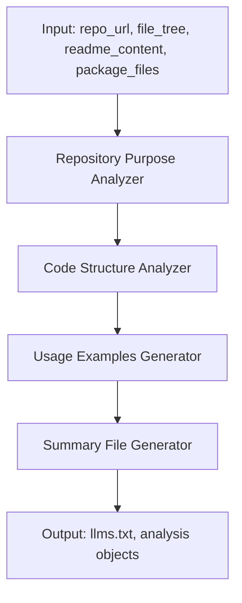
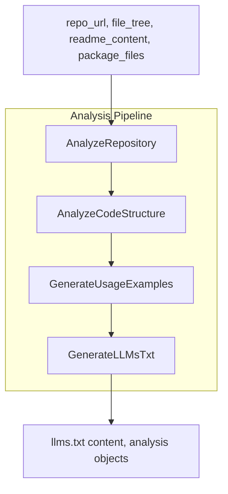

&abpn
## Unlocking Insights from Repository and Codebase Composition

In modern software development, understanding a project's repository structure and its underlying codebase is crucial for effective collaboration, maintenance, and enhancement. The **Repository and Code Structure Analysis** component serves as an intelligent system that examines a repository's layout and source code organization to uncover its key components, important directories, and critical files. Beyond mere inspection, it synthesizes these insights into a comprehensive summary file (<WalkThruCodeTag id="bebb027c-50b4-44a2-b8f3-f86bb134a0cd" path="analysis/repository_analyzer.py" line_data="# Generate final llms.txt" line_start="28" line_end="28" outdated="false" obsolete="false">llms.txt</WalkThruCodeTag>) that encapsulates the project's purpose, architecture, and development workflow.

This component plays a strategic role in streamlining onboarding processes, guiding developers through unfamiliar codebases, and enabling automated tools to reason about the project effectively. By programmatically dissecting the repository and its code, it reduces manual effort, mitigates misunderstandings, and fosters a shared understanding of the software's structure and intent.

&abpn
## Architectural Blueprint of the Repository Analysis Pipeline

The architecture of this component is modular and sequential, designed to progressively refine understanding from broad repository metadata to detailed code structure insights, culminating in a synthesized summary output. The key architectural elements include:

- **Repository Purpose Analyzer**: Extracts the main goals and conceptual vocabulary of the project by analyzing the repository URL, file tree, and README content.
- **Code Structure Analyzer**: Examines the file tree and package-related files to identify important directories, entry points, and development workflow information.
- **Usage Examples Generator**: Produces practical usage snippets based on the repository's purpose and key concepts, enhancing developer comprehension.
- **Summary File Generator**: Compiles all gathered information into a detailed <WalkThruCodeTag id="bebb027c-50b4-44a2-b8f3-f86bb134a0cd" path="analysis/repository_analyzer.py" line_data="# Generate final llms.txt" line_start="28" line_end="28" outdated="false" obsolete="false">llms.txt</WalkThruCodeTag> file that serves as a single source of truth for the repository's analysis.

These elements interact in a pipeline fashion, each feeding its output into the next stage, ensuring a coherent and comprehensive analysis.

&abpn

This design promotes separation of concerns, allowing each module to focus on a distinct aspect of the analysis while enabling seamless data flow. The modularity also facilitates easier maintenance and potential extension, such as adding more detailed static analysis or integrating other documentation sources.

&abpn
## Inside the RepositoryAnalyzer: Coordinating Multi-Faceted Analysis

At the heart of this component lies the <WalkThruCodeTag id="bebb027c-50b4-44a2-b8f3-f86bb134a0cd" path="analysis/repository_analyzer.py" line_data="class RepositoryAnalyzer(dspy.Module):" line_start="1" line_end="1" outdated="false" obsolete="false">RepositoryAnalyzer</WalkThruCodeTag> class, which orchestrates the entire analysis workflow. It leverages specialized signature classes and chain-of-thought modules to break down the problem into manageable parts.

&abpn
### Key Design Choices and Their Rationale

- **Use of Signature Classes (<WalkThruCodeTag id="bebb027c-50b4-44a2-b8f3-f86bb134a0cd" path="analysis/signatures.py" line_data="class AnalyzeRepository(dspy.Signature):" line_start="4" line_end="4" outdated="false" obsolete="false">AnalyzeRepository</WalkThruCodeTag>, <WalkThruCodeTag id="bebb027c-50b4-44a2-b8f3-f86bb134a0cd" path="analysis/signatures.py" line_data="class AnalyzeCodeStructure(dspy.Signature):" line_start="14" line_end="14" outdated="false" obsolete="false">AnalyzeCodeStructure</WalkThruCodeTag>)**: These classes define clear input and output fields representing the data required and produced during analysis. This approach enforces a structured contract for each analysis phase, improving code clarity and enabling automated reasoning about data flow.

- **Chain-of-Thought Modules**: By encapsulating each analysis step in a chain-of-thought module, the design supports complex reasoning and stepwise refinement. This is particularly useful when dealing with ambiguous or incomplete data, as the system can iteratively improve its understanding.

- **Forward Method as a Pipeline Coordinator**: The <WalkThruCodeTag id="bebb027c-50b4-44a2-b8f3-f86bb134a0cd" path="analysis/repository_analyzer.py" line_data="def forward(self, repo_url, file_tree, readme_content, package_files):" line_start="9" line_end="9" outdated="false" obsolete="false">forward</WalkThruCodeTag> method in <WalkThruCodeTag id="bebb027c-50b4-44a2-b8f3-f86bb134a0cd" path="analysis/repository_analyzer.py" line_data="class RepositoryAnalyzer(dspy.Module):" line_start="1" line_end="1" outdated="false" obsolete="false">RepositoryAnalyzer</WalkThruCodeTag> accepts the initial inputs and sequentially invokes the analysis modules. This linear flow ensures that each step has the necessary context from previous analyses, avoiding redundant computations.

&abpn
### Detailed Workflow in <WalkThruCodeTag id="bebb027c-50b4-44a2-b8f3-f86bb134a0cd" path="analysis/repository_analyzer.py" line_data="def forward(self, repo_url, file_tree, readme_content, package_files):" line_start="9" line_end="9" outdated="false" obsolete="false">forward</WalkThruCodeTag>

1. **Repository Purpose Analysis**:  
   Inputs: <WalkThruCodeTag id="bebb027c-50b4-44a2-b8f3-f86bb134a0cd" path="analysis/signatures.py" line_data="repo_url: str = dspy.InputField(desc=&quot;GitHub repository URL&quot;)" line_start="6" line_end="6" outdated="false" obsolete="false">repo_url</WalkThruCodeTag>, <WalkThruCodeTag id="bebb027c-50b4-44a2-b8f3-f86bb134a0cd" path="analysis/signatures.py" line_data="file_tree: str = dspy.InputField(desc=&quot;Repository file structure&quot;)" line_start="7" line_end="7" outdated="false" obsolete="false">file_tree</WalkThruCodeTag>, <WalkThruCodeTag id="bebb027c-50b4-44a2-b8f3-f86bb134a0cd" path="analysis/signatures.py" line_data="readme_content: str = dspy.InputField(desc=&quot;README.md content&quot;)" line_start="8" line_end="8" outdated="false" obsolete="false">readme_content</WalkThruCodeTag>  
   Outputs: <WalkThruCodeTag id="bebb027c-50b4-44a2-b8f3-f86bb134a0cd" path="analysis/signatures.py" line_data="project_purpose: str = dspy.OutputField(desc=&quot;Main purpose and goals of the project&quot;)" line_start="10" line_end="10" outdated="false" obsolete="false">project_purpose</WalkThruCodeTag>, <WalkThruCodeTag id="bebb027c-50b4-44a2-b8f3-f86bb134a0cd" path="analysis/signatures.py" line_data="key_concepts: list[str] = dspy.OutputField(desc=&quot;List of important concepts and terminology&quot;)" line_start="11" line_end="11" outdated="false" obsolete="false">key_concepts</WalkThruCodeTag>, <WalkThruCodeTag id="bebb027c-50b4-44a2-b8f3-f86bb134a0cd" path="analysis/signatures.py" line_data="architecture_overview: str = dspy.OutputField(desc=&quot;High-level architecture description&quot;)" line_start="12" line_end="12" outdated="false" obsolete="false">architecture_overview</WalkThruCodeTag>  
   This step interprets the repository metadata and documentation to extract the essence of the project.

2. **Code Structure Analysis**:  
   Inputs: <WalkThruCodeTag id="bebb027c-50b4-44a2-b8f3-f86bb134a0cd" path="analysis/signatures.py" line_data="file_tree: str = dspy.InputField(desc=&quot;Repository file structure&quot;)" line_start="7" line_end="7" outdated="false" obsolete="false">file_tree</WalkThruCodeTag>, <WalkThruCodeTag id="bebb027c-50b4-44a2-b8f3-f86bb134a0cd" path="analysis/signatures.py" line_data="package_files: str = dspy.InputField(desc=&quot;Key package and configuration files&quot;)" line_start="17" line_end="17" outdated="false" obsolete="false">package_files</WalkThruCodeTag>  
   Outputs: <WalkThruCodeTag id="bebb027c-50b4-44a2-b8f3-f86bb134a0cd" path="analysis/signatures.py" line_data="important_directories: list[str] = dspy.OutputField(desc=&quot;Key directories and their purposes&quot;)" line_start="19" line_end="19" outdated="false" obsolete="false">important_directories</WalkThruCodeTag>, <WalkThruCodeTag id="bebb027c-50b4-44a2-b8f3-f86bb134a0cd" path="analysis/signatures.py" line_data="entry_points: list[str] = dspy.OutputField(desc=&quot;Main entry points and important files&quot;)" line_start="20" line_end="20" outdated="false" obsolete="false">entry_points</WalkThruCodeTag>, <WalkThruCodeTag id="bebb027c-50b4-44a2-b8f3-f86bb134a0cd" path="analysis/signatures.py" line_data="development_info: str = dspy.OutputField(desc=&quot;Development setup and workflow information&quot;)" line_start="21" line_end="21" outdated="false" obsolete="false">development_info</WalkThruCodeTag>  
   This phase identifies the critical structural elements of the codebase, such as main directories and files relevant for development and execution.

3. **Usage Examples Generation**:  
   Input: Concatenated repository purpose and concepts  
   Output: Practical usage examples to aid developers in understanding how to interact with the project.

4. **Summary File Generation (<WalkThruCodeTag id="bebb027c-50b4-44a2-b8f3-f86bb134a0cd" path="analysis/repository_analyzer.py" line_data="# Generate final llms.txt" line_start="28" line_end="28" outdated="false" obsolete="false">llms.txt</WalkThruCodeTag>)**:  
   Inputs: All previously gathered outputs  
   Output: A comprehensive textual summary that consolidates the analysis, serving as a valuable artifact for documentation or automated processing.

&abpn

&abpn
### Why This Approach?

- **Clarity and Maintainability**: By defining discrete classes with explicit inputs and outputs, the system is easier to understand, test, and extend.
- **Reusability**: Each analysis module can be reused independently or replaced with improved versions without affecting the overall pipeline.
- **Comprehensive Output**: The final <WalkThruCodeTag id="bebb027c-50b4-44a2-b8f3-f86bb134a0cd" path="analysis/repository_analyzer.py" line_data="# Generate final llms.txt" line_start="28" line_end="28" outdated="false" obsolete="false">llms.txt</WalkThruCodeTag> file encapsulates all critical insights, making it a single reference point for developers and tools alike.

&abpn
### Reference

The entire orchestration is implemented in the <WalkThruCodeTag id="bebb027c-50b4-44a2-b8f3-f86bb134a0cd" path="analysis/repository_analyzer.py" line_data="class RepositoryAnalyzer(dspy.Module):" line_start="1" line_end="1" outdated="false" obsolete="false">RepositoryAnalyzer</WalkThruCodeTag> class within <WalkThruRef id="bebb027c-50b4-44a2-b8f3-f86bb134a0cd" obsolete="false">[analysis/repository_analyzer.py](analysis/repository_analyzer.py)</WalkThruRef> (lines 1-43), with signature definitions in <WalkThruRef id="bebb027c-50b4-44a2-b8f3-f86bb134a0cd" obsolete="false">[analysis/signatures.py](analysis/signatures.py)</WalkThruRef> (lines 4-21).

&abpn
## Sources

- <WalkThruRef id="bebb027c-50b4-44a2-b8f3-f86bb134a0cd" obsolete="false">[analysis/repository_analyzer.py](analysis/repository_analyzer.py)</WalkThruRef>
- <WalkThruRef id="bebb027c-50b4-44a2-b8f3-f86bb134a0cd" obsolete="false">[analysis/signatures.py](analysis/signatures.py)</WalkThruRef>