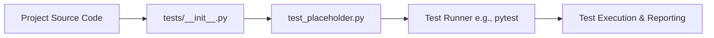

&abpn
## Laying the Groundwork for Reliable Project Validation

Testing is a foundational pillar in any software project, ensuring that the implemented functionality behaves as expected and regressions are caught early. The *Testing Framework Setup* subchapter introduces the initial scaffolding for the project's test suite. This setup includes placeholder test files that serve as templates or starting points for writing concrete test cases to validate various aspects of the project functionality.

By establishing these placeholders early, the project defines a clear convention and location for future tests, promoting consistency and encouraging developers to contribute tests alongside their code changes. This proactive approach to testing infrastructure helps maintain software quality as the project evolves, aligning with best practices in continuous integration and delivery pipelines.

&abpn
## Structural Elements of the Testing Framework

The testing framework setup revolves around two key architectural elements:

- **Test Package Initialization (`__init__.py`)**: This file marks the directory as a Python package, enabling the test discovery mechanisms of common testing tools such as `pytest` or `unittest`. It provides a namespace for organizing test modules cohesively.

- **Placeholder Test Module (`test_placeholder.py`)**: This module contains a minimal test function that always passes. It acts as a template and a sanity check to verify that the testing infrastructure is correctly configured and operational.

Together, these elements establish the groundwork for a scalable and maintainable test suite. The `__init__.py` ensures that tests can be grouped and imported as a package, which is crucial for larger projects with multiple test modules. The placeholder test serves as a simple example and a confidence check for the test runner setup.

&abpn

This diagram illustrates the relationship between the source code, the test package initialization, the placeholder test, and the testing framework's execution flow.

&abpn
## The Design Rationale Behind the Placeholder Tests

The provided `test_placeholder.py` file contains a single test function:

This minimalist test is intentional and strategic:

- **Verification of Test Environment**: By including a test that unconditionally passes, developers can immediately confirm that the testing framework is correctly installed and configured. If this test fails or is not discovered, it signals an issue with the test setup rather than the application code.

- **Template for Future Tests**: It serves as a straightforward example for developers unfamiliar with the project’s testing conventions. They can replicate this structure to create new tests, ensuring consistency across the codebase.

- **Encouragement of Test-Driven Development**: Having a placeholder test file signals that testing is an integral part of the development process. It lowers the barrier to adding meaningful tests by providing a ready-made location and format.

The `__init__.py` file, although empty, is equally important. Its presence tells Python and test discovery tools that the `tests` directory is a package. This enables importing test modules and running tests collectively.

Together, these files form a minimal but complete testing framework foundation that balances simplicity with scalability. As the project grows, more complex and targeted tests can be added in the same structure without restructuring the test suite.

*(see tests/test_placeholder.py:1-2, tests/__init__.py:1)*

&abpn
## Related Sub-Chapters

For a comprehensive understanding of how testing integrates with the overall project, see the *Project Structure and Modules* subchapter, which details how the codebase is organized to facilitate modular development and testing. Additionally, the *Entry Point and Initialization* subchapter explains how the application bootstraps, which is often critical information for writing effective integration and system tests.

&abpn
## Sources

- `tests/__init__.py`
- <WalkThruRef id="8af29514-f97f-4cd4-ab46-221da94e8744" obsolete="false">[tests/test_placeholder.py](tests/test_placeholder.py)</WalkThruRef>